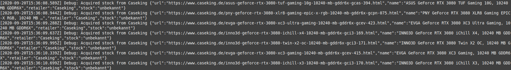

# ilovertx3000

**ilovertx3000** is a bot which crawls stock statuses from different sources and *tweets* changes. Follow it on [Twitter](https://twitter.com/ilovertx3000)!

## F.A.Q.

### Does this bot buy GPUs?

***No***. This bot does __not__ buy anything - it just *observes* stock statuses and announces changes on Twitter. It doesn't 
try to give anyone an unfair advantage and just wants to help in equalizing chances in getting a new GPU.

### What shops are currently being crawled?

- Caseking
- alternate.de
- EVGA Shop
- nVidia DE Shop

### Why?

People are using bots to gain an unfair advantage against others. Bots are faster and don't rely on human interaction in order to 
get what they want (in our case: GPUs). This bot just tries to help in increasing the chance to get a GPU before they're sold out again
to bots.

### Should I run this bot myself?

No. Crawling always comes at a cost for the other end - or, in other words, the shop servers which are crawled have to serve 
additional requests. Since this bot tweets about all changes on stock changes it's absolutely sufficient to just follow its account.

### Can you add shop X?

Depending on the need of it, yes.

### Can you add a new notification channel (like Discord)?

Technically yes - but, again, it depends on the need.

### Could this bot also track PS 5 / other stock availabilities?

Yep, but for now its limited to GPUs.

### How often does this bot check a shop?

Every 30 seconds by default.

### I'm the owner of shop X and don't want this bot to crawl my shop!

I don't want to bother anyone and in case my bot puts too much weight on your server just drop me a message at ilovertx3000[at]nehalist.io or [DM me on Twitter](https://twitter.com/nehalist) and I'll 
remove your shop from the bot.

### I'm a scalper; can I use this bot for / instead of / with ...

Fuck you.

## Like the bot?

Happy to hear that! Feel free to star it on GitHub and follow it on Twitter!

## Author

Developed by [nehalist.io](https://nehalist.io).